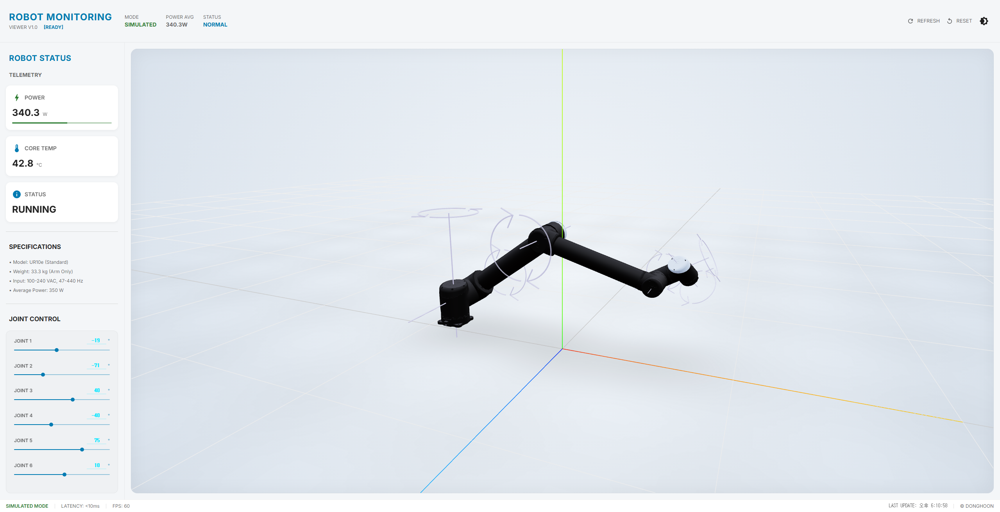

# Client-side real-time robot monitoring dashboard with 3D digital twin visualization

React, @react-three/fiber, Zustand. Simulated data for scalable, zero-server-cost monitoring (ROS2 integration ready).

[](https://robot-monitoring-dashboard.vercel.app/)
[](https://github.com/ssaviour0/robot-monitoring-dashboard.git)

산업용 디지털 트윈 모니터링 시스템의 **클라이언트 중심 고성능 웹 프론트엔드** 구현 프로젝트입니다.  
실무에서 서버 중심 스트리밍 방식의 구조적 한계(고비용 GPU 서버, 확장성 제약, 자원 낭비)를 인지하고, **클라이언트 측 3D 렌더링 + 모의 실시간 데이터** 접근으로 서버 부하를 최소화하고 무제한 확장성을 목표로 개인 R&D했습니다.

(실제 ROS2/WebSocket 연결 시 동일 UI 구조와 대부분의 로직 재사용 가능하도록 설계)

### 데모
🔗 **라이브 데모**: [https://robot-monitoring-dashboard.vercel.app](https://robot-monitoring-dashboard.vercel.app/)  
(글로벌 CDN 정적 배포 → OPEX zero, 60fps 부드러운 애니메이션)


*(메인 3D 캔버스 + 실시간 조인트/텔레메트리 패널)*

### 프로젝트 배경 & 동기
실무 디지털 트윈 프로젝트 경험 중 발견한 핵심 문제점:

1. **인프라 비용 폭증** (High OPEX): 사용자 증가 → 고사양 GPU 서버 운영 비용 급등  
2. **확장성 한계**: 네트워크 대역폭 + 동시 세션 물리적 제한  
3. **자원 낭비**: 단순 read-only 모니터링 사용자에게도 과도한 서버 컴퓨팅 할당  

→ **클라이언트 측 고성능 3D 렌더링** + **추론 기반의 자연스러운 모의 실시간 시뮬레이션**으로 해결  
→ 서버 의존성 최소화 → 비용 절감 + 무한 사용자 확장 가능

### 주요 특징
- @react-three/fiber + drei 기반 **클라이언트 측 100% 3D 렌더링**
- Zustand로 joint angles, telemetry 등 **모의 데이터 바인딩**
- **포즈 기반 보간(Interpolation)** 알고리즘으로 구현된 **자연스러운 로봇 움직임**
- glTF/GLB **Draco + Meshopt 압축** 최적화 (평균 15~20MB → 빠른 초기 로드)
- **Vercel 정적 배포** (zero 서버 비용, 글로벌 CDN)
- 실제 ROS2 토픽 스키마 기반 시뮬레이션 → 실 ROS2 연결 시 UI/훅 재사용 용이
- Feature-Sliced Design (FSD) 기반 **확장성 높은 구조**

### 아키텍처 비교 (산업 표준 vs 본 프로젝트)

| 영역             | 산업 표준 (서버 중심)                          | 본 프로젝트 (클라이언트 중심)                          | 비고                              |
|------------------|------------------------------------------------|-------------------------------------------------------|-----------------------------------|
| 씬 정보 제공     | URDF/USD → 실시간 glTF 스트리밍                | glTF 2.0 / GLB 정적 파일 (public/assets)              | 서버 스트리밍 대신 정적 에셋      |
| 설비 데이터 제공 | ROS2 + WebSocket 실시간 스트리밍               | React + requestAnimationFrame + Math 기반 시뮬레이션   | 실제 토픽 스키마 기반 모델링      |
| 웹 렌더링        | 서버 측 렌더링 + WebRTC/스트리밍               | React 18 + @react-three/fiber + drei + MUI + Zustand  | 핵심 구현 영역 (95% 이상)         |

**데이터 흐름**  
`glTF/GLB 로드` → `Zustand 모의 데이터 업데이트 (60fps)` → `Three.js 클라이언트 렌더링` → `대시보드 UI`

### 기술 스택 (2026 기준 최신)
- **Core**: React 18 + TypeScript, Vite 5, @react-three/fiber, @react-three/drei, three.js  
- **상태 관리**: Zustand – boilerplate 적고 feature-sliced 구조에 최적  
- **UI**: Material-UI (MUI v5) – 산업용 느낌의 컴포넌트 빠른 구현  
- **시뮬레이션**: requestAnimationFrame + lerp/easing – 부드러운 움직임  
- **에셋 최적화**: glTF/GLB (Draco + Meshopt 압축) – 파일 크기 60~70% ↓  
- **배포**: Vercel – 정적 호스팅, Preview, zero-config CI/CD  
- **개발 도구**: ESLint + Prettier + Husky, GitHub Actions + Vercel

### 프로젝트 구조 (Feature-Sliced Design 기반)
```
src/
├── app/                  # 진입점, 라우팅, Provider
├── core/                 # 범용 공통 (api, utils, base hooks)
├── features/
│   └── robot/            # 메인 기능: 로봇 모니터링 (colocation 최대화)
│       ├── components/   # RobotCanvas, JointsPanel, TelemetryCard 등
│       ├── hooks/        # useRobotAnimation, useSimulatedData 등
│       ├── store/        # robotStore.ts (Zustand)
│       ├── services/     # simulationEngine.ts
│       ├── types/        # RobotState, JointAngles 등
│       └── index.ts      # barrel export
├── pages/                # DashboardPage.tsx (조립소 역할)
├── shared/               # atomic UI (Gauge, StatBadge, layouts)
└── assets/               # 글로벌 이미지 등 (기능별 에셋은 features/robot/assets/)
```

### 설치 & 실행 (From Scratch)

```bash
# Node.js 22.x LTS (2026 Active LTS)
nvm install 22
nvm use 22

# 클론 & 설치
git clone https://github.com/ssaviour0/robot-monitoring-dashboard.git
cd robot-monitoring-dashboard
pnpm install   # or npm install / yarn

# 개발 서버
pnpm dev

# 린트 검사 (코드 스타일 및 잠재적 에러)
pnpm lint

# 빌드 검사 (TypeScript 타입 체크 + 정적 파일 생성)
pnpm build

# 빌드 결과물 미리보기
pnpm preview
```

### 향후 계획 / 확장 포인트

- **ROS2 Bridge** 연결 (`features/robot/services/rosBridge.ts` 추가 → 기존 훅에서 simulated → real-time 데이터 전환)
- **WebXR (AR/VR)** 모드 탐구 (몰입형 관제 경험)
- **Performance profiling** + WebGPU fallback
- **다양한 로봇 모델** 지원 (Delta, Scara 등 kinematics 확장)

### 라이선스
MIT License – 자유롭게 사용/수정/포크 가능 (출처 표기 부탁드려요 🙏)

피드백이나 Pull Request 언제든 환영합니다! 🚀
